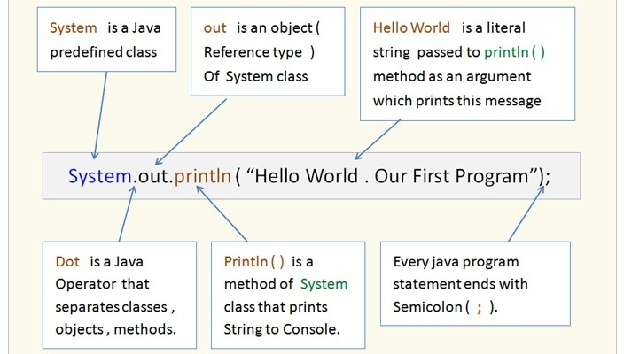

# ¡Hola Mundo! Tu Primer Programa

## Video de la Clase

*Enlace al video de YouTube:* [Añadir enlace aquí]

## Entorno de Práctica

Empieza a programar de inmediato (¡Sin instalar nada!):

- **[Abrir OnlineGDB - Código inicial precargado: https://onlinegdb.com/k7D7hK9uZ](https://onlinegdb.com/k7D7hK9uZ)**


*La captura muestra el entorno listo para ejecutar el primer programa sin instalar nada.*

## Notas de la Clase

¡Hola a todos! Bienvenidos a "Java para Creadores". Hoy daremos el primer paso para convertirnos en creadores de tecnología. Aprenderemos a hablar el idioma de las computadoras usando Java.


**¿Qué es el código?**
Piensa en programar como escribir una receta de cocina. La computadora es un chef excelente y rápido, pero necesita instrucciones extremadamente precisas. Cada línea de código es un paso en esa receta.


**Nuestro Primer Programa**
Para nuestro primer programa no necesitas instalar nada. Haremos que la computadora nos salude con la tradición de "Hola Mundo", usando la instrucción `System.out.println("¡Hola Mundo!");`.



- `class`: Es como el recetario completo.
- `main`: Es la puerta principal por donde el chef entra a leer la primera receta.
- `{}` (Llaves): Actúan como las tapas de un libro que encierran las instrucciones.


## Actividad Práctica de la Clase: 

**El Reto de la Presentación:**
Ya lograste que la computadora diga "¡Hola Mundo!". Ahora, tu objetivo es cambiar el mensaje para presentarte a ti mismo.

1. Identifica la frase entre comillas en el código: `"¡Hola Mundo!..."`
2. Cámbiala por algo como `"¡Hola, soy [Tu Nombre] y me encanta el helado!"`
3. Presiona el botón de "Ejecutar" (Run) en tu plataforma y verifica que funcione.

_Nota: Recuerda no borrar las comillas `""` ni el punto y coma `;` al final de la instrucción._

## Proyecto Integrador: El Registro de Estudiantes

A lo largo del curso, construiremos juntos un pequeño sistema para registrar estudiantes en un club escolar. Nuestra contribución en esta primera lección será muy sencilla: darle la bienvenida al usuario al iniciar el sistema.

**Agrega estas líneas a tu código:**

```java
System.out.println("--- Sistema de Registro del Club Escolar ---");
System.out.println("¡Bienvenido al sistema!");
```

## Recursos Complementarios del Proyecto

- **Código inicial de la lección:** [starter-files/lesson-01/Main.java](../../starter-files/lesson-01/Main.java)
- **Código elaborado en clase:** [completed-examples/lesson-01/Main.java](../../completed-examples/lesson-01/Main.java)


---

\newpage