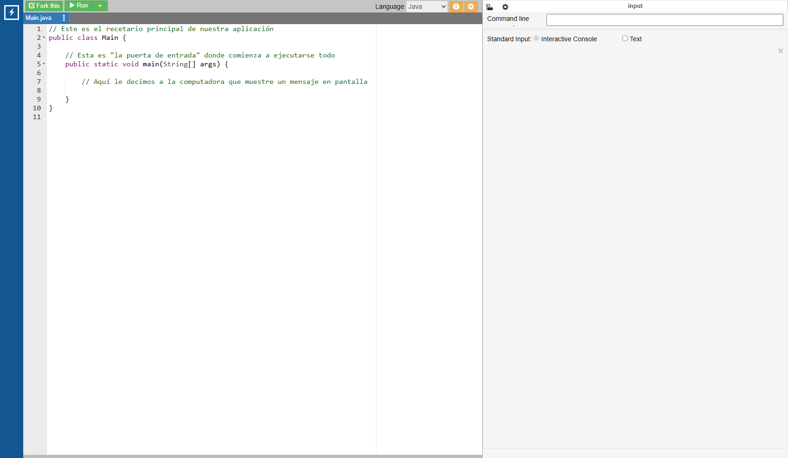
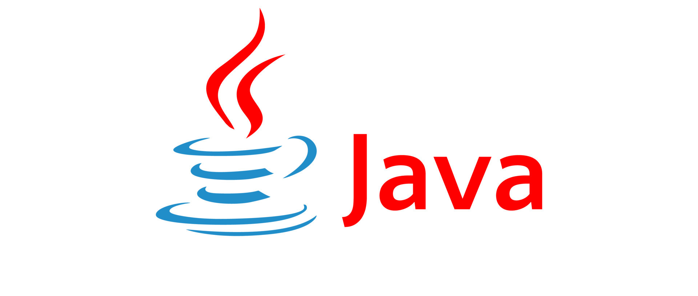
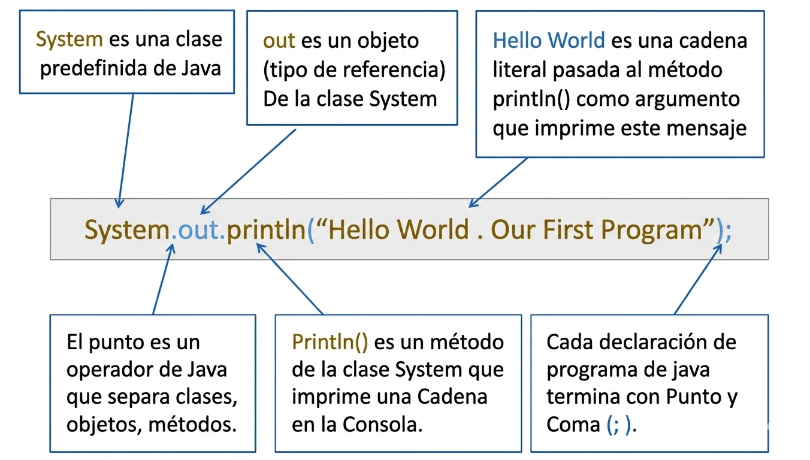

# ¡Hola Mundo! Tu Primer Programa

## Video de la Clase y Entorno de Práctica

*Enlace al video de YouTube:* [Añadir enlace aquí]

Para esta primera clase y en todo el curso no necesitas instalar ningún programa en tu computadora. Vamos a usar **OnlineGDB**, un entorno de programación en línea que funciona directamente desde el navegador. Solo haz clic en el siguiente enlace y verás el código inicial de la clase ya listo para ejecutar: [**https://onlinegdb.com/k7D7hK9uZ**](https://onlinegdb.com/k7D7hK9uZ)

Una vez que abras el enlace, verás una interfaz dividida en dos paneles: a la izquierda está el editor de código donde escribiremos nuestras instrucciones, y a la derecha aparecerá la consola donde la computadora nos mostrará los resultados. Para ejecutar el programa, simplemente presiona el botón verde de "Run" en la parte superior.

{width=80%}

## Notas de la Clase

¡Hola a todos! Bienvenidos a "Java para Creadores". Este es el momento más emocionante de todo el curso: el punto de partida. Hoy daremos nuestro primer paso para convertirnos en creadores de tecnología. Aprenderemos a hablar el idioma de las computadoras usando Java, uno de los lenguajes de programación más utilizados en el mundo.

Java fue creado en 1995 por James Gosling en Sun Microsystems (hoy parte de Oracle). Su lema siempre ha sido *"Write Once, Run Anywhere"* (Escribe una vez, ejecuta en todas partes), lo que significa que un programa escrito en Java puede funcionar en cualquier dispositivo sin necesidad de reescribirlo. Esto lo hace ideal para aplicaciones móviles, sistemas empresariales, videojuegos y mucho más.

{width=50%}

**¿Qué es el código?**

Antes de escribir nuestra primera línea de código, es importante entender qué es programar. Piensa en programar como escribir una receta de cocina. Cuando cocinas, sigues una serie de pasos en un orden específico: primero lavas los ingredientes, luego los cortas, después los cocinas y finalmente sirves el plato. Cada paso debe ser claro y preciso para que el resultado sea el esperado.

La computadora funciona de manera similar. Es una máquina increíblemente rápida y precisa, pero no puede adivinar lo que quieres hacer. Necesita instrucciones extremadamente claras y detalladas. Cada línea de código que escribamos será un paso en esa receta que la computadora seguirá al pie de la letra. Si hay un error en una instrucción, la computadora no podrá completar la tarea correctamente, igual que si una receta tiene un paso equivocado.

La diferencia principal es que, mientras una receta de cocina puede usar palabras como "un poco de sal" o "a fuego medio", la computadora necesita cantidades exactas y temperaturas precisas. No hay lugar para la ambigüedad en el código.

{width=60%}

**Nuestro Primer Programa**

Para nuestro primer programa usaremos la tradición del "Hola Mundo". Esta tradición comenzó en 1978 con el libro *The C Programming Language* de Brian Kernighan y Dennis Ritchie, donde apareció el primer ejemplo de un programa que imprimía "Hello, World!" en pantalla. Desde entonces, casi todos los cursos de programación comienzan con este simple ejercicio.

La idea es sencilla: le pediremos a la computadora que nos salude escribiendo "¡Hola Mundo!" en la pantalla. Para lograrlo, usaremos la instrucción `System.out.println("¡Hola Mundo!");`, que le indica a Java que imprima el texto entre comillas en la consola.

Aquí está el código completo de nuestro primer programa:

```java
// Este es el recetario principal de nuestra aplicación
public class Main {
    // Esta es "la puerta de entrada" donde comienza a ejecutarse todo
    public static void main(String[] args) {
        // Aquí le decimos a la computadora que muestre un mensaje en pantalla
        System.out.println("¡Hola Mundo!");
    }
}
```

Analicemos cada parte de este código:

- `public class Main`: Esta línea define una clase llamada "Main". En Java, todo el código debe estar dentro de una clase. Piensa en la clase como el recetario completo que contiene todas las instrucciones.
- `public static void main(String[] args)`: Esta es el método principal, el punto de entrada del programa. Es como la puerta principal por donde el chef entra a leer la primera receta. Sin esta línea, la computadora no sabe por dónde empezar a ejecutar el código.
- `{}` (Llaves): Las llaves de apertura y cierre actúan como las tapas de un libro que encierran las instrucciones. Todo lo que está entre las llaves principales es parte del programa.
- `System.out.println("¡Hola Mundo!");`: Esta es la instrucción que le dice a la computadora qué hacer. El texto entre comillas es el mensaje que se imprimirá en pantalla. El punto y coma `;` al final indica que la instrucción ha terminado.

Cuando ejecutes este programa, verás aparecer "¡Hola Mundo!" en la consola de la derecha. ¡Felicidades! Acaban de escribir su primer programa en Java.

{width=80%}

## Actividad Práctica de la Clase: 

**El Reto de la Presentación:**

Ya lograste que la computadora diga "¡Hola Mundo!". Ahora es momento de hacer algo más personal. Tu objetivo es cambiar el mensaje para presentarte a ti mismo. Este ejercicio te ayudará a entender cómo modificar el contenido de un programa y a practicar con la sintaxis básica de Java.

_Nota: Recuerda no borrar las comillas `""` ni el punto y coma `;` al final de la instrucción. Son elementos obligatorios en la sintaxis de Java. Si olvidas alguno de ellos, el programa no funcionará y recibirás un mensaje de error._

## Proyecto Integrador: El Registro de Estudiantes

A lo largo del curso, construiremos juntos un pequeño sistema para registrar estudiantes en un club escolar. Este proyecto nos servirá para practicar todos los conceptos que vayamos aprendiendo en cada clase. Nuestra contribución en esta primera lección será muy sencilla: darle la bienvenida al usuario al iniciar el sistema.

En el mundo real, los programas de computadora suelen comenzar con un mensaje de bienvenida o una pantalla de inicio. Esto ayuda al usuario a saber que el sistema está funcionando correctamente y le indica cómo comenzar a usarlo.

**Agrega estas líneas a tu código:**

```java
System.out.println("--- Sistema de Registro del Club Escolar ---");
System.out.println("¡Bienvenido al sistema!");
```

Estas dos líneas usan la misma instrucción `System.out.println()` que aprendimos anteriormente. La primera imprime el nombre del sistema entre guiones para destacarlo, y la segunda muestra un mensaje de bienvenida. Cuando ejecutes el programa, verás ambos mensajes aparecer en la consola, uno debajo del otro.

A medida que avancemos en el curso, iremos agregando más funcionalidades a este sistema, como la capacidad de registrar nuevos estudiantes, consultar información y generar reportes.

## Recursos Complementarios de la Clase

- **Código inicial de la lección:** [starter-files/lesson-01/Main.java](https://github.com/upc-pre-1asi0729-11848-arcadiadevs/java-fundamentals-course-arcadiadevs/blob/main/starter-files/lesson-01/Main.java)
- **Código elaborado en clase:** [completed-examples/lesson-01/Main.java](https://github.com/upc-pre-1asi0729-11848-arcadiadevs/java-fundamentals-course-arcadiadevs/blob/main/completed-examples/lesson-01/Main.java)

\newpage
