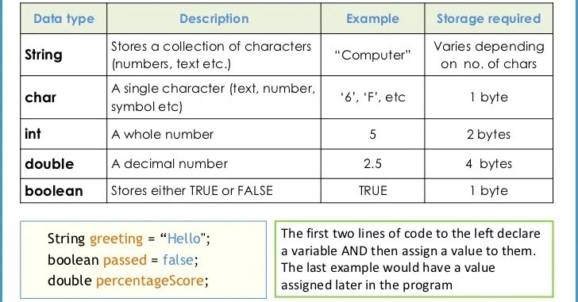

# Cajas Mágicas (Variables y Datos)

## Video de la Clase
*Enlace al video de YouTube:* [Añadir enlace aquí]

## Entorno de Práctica
Empieza a programar de inmediato (¡Sin instalar nada!):

- **[Abrir OnlineGDB - Código inicial precargado: https://onlinegdb.com/O6b5gyEv2](https://onlinegdb.com/O6b5gyEv2)**


## Notas de la Clase
¡Hola, creadores! Qué genial verlos de nuevo. En nuestra lección pasada, logramos que la computadora nos saludara, pero ¿qué pasa si queremos que recuerde nuestro nombre, nuestra edad o nuestro puntaje favorito en un videojuego? Así como nosotros tenemos una memoria para recordar cosas, debemos enseñarle a nuestra aplicación a guardar información. Aquí entran en juego nuestras protagonistas de hoy: ¡las cajas mágicas de Java!


**¿Qué es una Variable?**
Imagina que estás ordenando tu cuarto. Para que no haya un desastre, usas cajas de cartón. A una le pones una etiqueta que dice "Zapatos", a otra "Videojuegos", y guardas las cosas correctas dentro. En programación, a estas cajas con etiquetas les llamamos **variables**. Tienen un nombre (la etiqueta) y guardan un dato en su interior. Java te obliga a decirle exactamente qué tipo de caja vas a usar.


**Tipos de Cajas (Tipos de Datos):**
1. **Caja de texto (String):** Imagina que es un cordón donde enhebras letras para formar palabras o frases. El texto siempre va dentro de comillas dobles "".
2. **Caja para números enteros (int):** Aquí guardamos edades, cantidades exactas o vidas que le quedan a un personaje. No lleva comillas.
3. **Caja para números decimales (double):** Se usa cuando las fracciones son importantes, como medir la altura en metros (1.75). Usamos un punto (.) en lugar de comas decimales.



**Cómo crear variables:**
Para crear nuestra caja primero decimos de qué tipo es, luego su etiqueta y qué le ponemos adentro:

```java
String nombreMagico = "Merlín";
```

Luego, podemos imprimir el contenido de nuestra caja usando `System.out.println(nombreMagico);` (esta vez sin comillas).


## Actividad Práctica: 

**El Reto del Superhéroe:**
Tu aplicación necesita almacenar los perfiles de los nuevos reclutas con poderes.

1. Mira el código de ejemplo anterior donde dice "Alex", 15 y 1.68.
2. Borra esos valores y cámbialos por información sobre tu superhéroe o personaje favorito (ej. `nombrePersonaje = "Spiderman";`).
3. Presiona "Ejecutar" (Run) y verifica cómo la consola ahora imprime un perfil diferente.

_Nota: ¡No olvides los puntos y comas (`;`) al final de cada nueva línea de código!_

## Proyecto Integrador: El Registro de Estudiantes

Continuemos trabajando en nuestra aplicación del **Registro del Club Escolar**. Ahora agregaremos variables que recordarán los detalles del primer estudiante inscrito.

**Agrega al código de nuestro sistema de registro:**

```java
// Variables del estudiante
String nombreEstudiante = "María Pérez";
int edadEstudiante = 16;
double promedioNotas = 18.5;

// Mostrando la información en pantalla
System.out.println("--- Sistema de Registro del Club Escolar ---");
System.out.println("¡Bienvenido al sistema!");
System.out.println("Inscrito: " + nombreEstudiante);
System.out.println("Edad: " + edadEstudiante);
System.out.println("Promedio: " + promedioNotas);
```

## Recursos Complementarios del Proyecto


- **Código inicial de la lección:** [starter-files/lesson-02/Main.java](../../starter-files/lesson-02/Main.java)
- **Código elaborado en clase:** [completed-examples/lesson-02/Main.java](../../completed-examples/lesson-02/Main.java)

\newpage