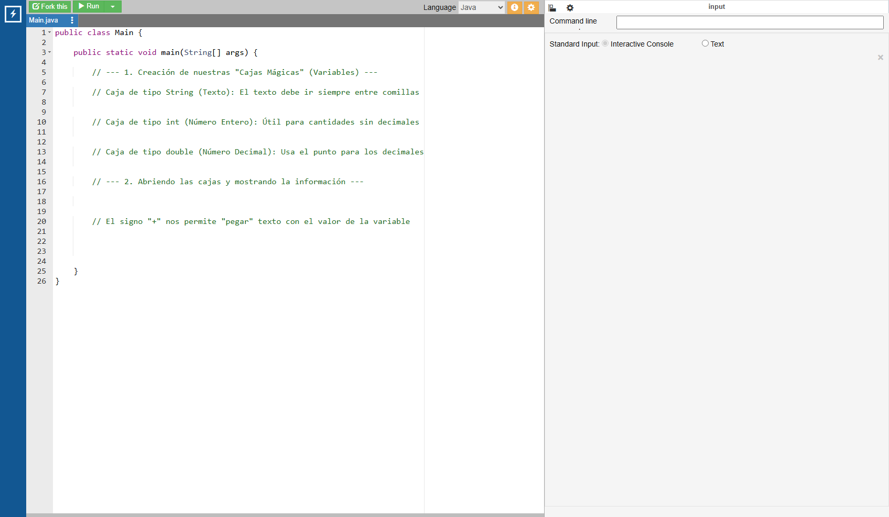
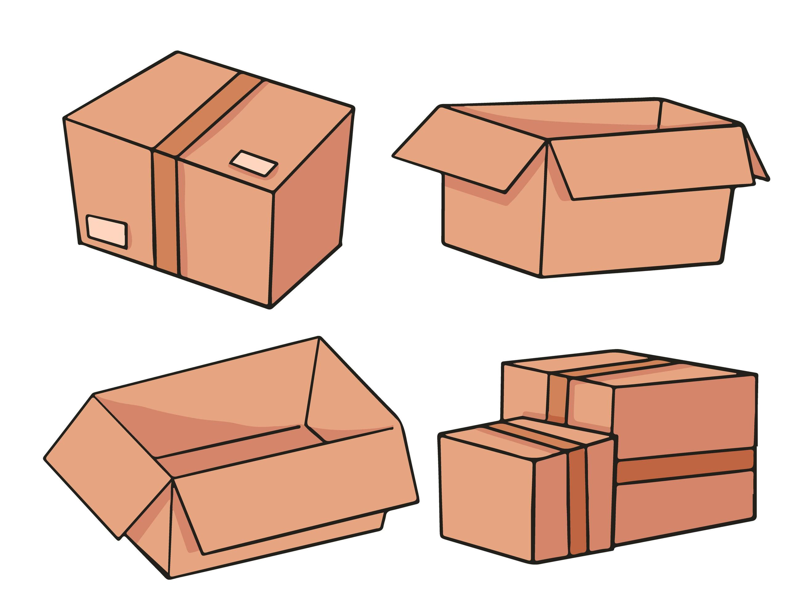
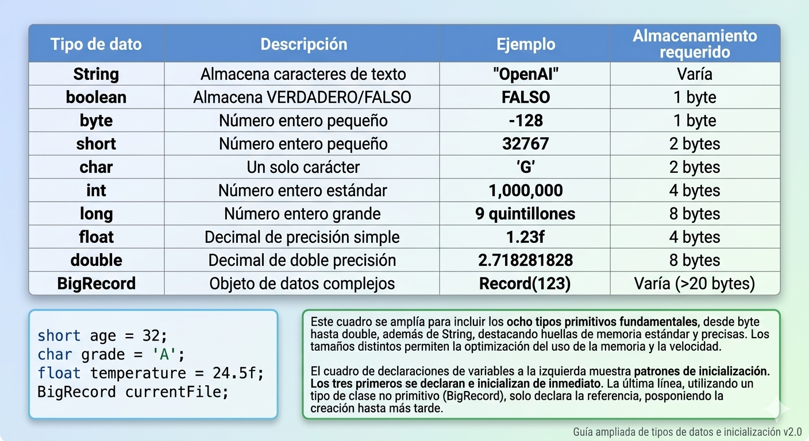

# Cajas Mágicas (Variables y Datos)

## Video de la Clase y Entorno de Práctica

*Enlace al video de YouTube:* [**https://youtu.be/p_KOy6f-76Q**](https://youtu.be/p_KOy6f-76Q)

Para esta clase continuaremos usando **OnlineGDB**, el mismo entorno en línea que usamos la clase pasada. No necesitas instalar nada en tu computadora. Haz clic en el siguiente enlace para abrir el código inicial de la clase ya precargado: [**https://onlinegdb.com/O6b5gyEv2**](https://onlinegdb.com/O6b5gyEv2)

Al igual que en la clase anterior, verás la interfaz con el editor de código a la izquierda y la consola a la derecha. Recuerda que para ejecutar el programa debes presionar el botón verde de "Run" en la parte superior de la pantalla.

{width=80%}

## Notas de la Clase

¡Hola, creadores! Qué genial verlos de nuevo. En nuestra lección pasada, logramos que la computadora nos saludara con el clásico "Hola Mundo". Pero ¿qué pasa si queremos que la computadora recuerde información? Por ejemplo, si queremos que guarde nuestro nombre, nuestra edad o nuestro puntaje favorito en un videojuego, necesitamos una forma de almacenar esos datos.

Así como nosotros tenemos una memoria para recordar cosas, debemos enseñarle a nuestra aplicación a guardar información. En el mundo real, cuando vas a una tienda y pides un producto, el vendedor busca en sus estantes y te entrega lo que necesitas. La computadora hace algo similar: busca la información que le pedimos y nos la devuelve. Pero para que esto funcione, primero necesitamos enseñarle dónde y cómo guardar esa información.

Aquí entran en juego nuestras protagonistas de hoy: ¡las cajas mágicas de Java! Estas cajas nos permiten almacenar datos que podemos usar y modificar a lo largo de nuestro programa.

{width=50%}

**¿Qué es una Variable?**

Imagina que estás ordenando tu cuarto. Para que no haya un desastre, usas cajas de cartón. A una le pones una etiqueta que dice "Zapatos", a otra "Videojuegos", y guardas las cosas correctas dentro. Si necesitas encontrar tus zapatos rápidamente, solo tienes que buscar la caja con esa etiqueta en vez de revisar todo el cuarto.

En programación, a estas cajas con etiquetas les llamamos **variables**. Una variable tiene tres elementos importantes:

1. **Un tipo:** Define qué tipo de dato puede guardar (texto, números, etc.). Es como el tamaño de la caja.
2. **Un nombre (etiqueta):** Es cómo la identificamos en nuestro código. Debe tener sentido para que podamos recordarla fácilmente.
3. **Un valor:** Es el dato que guardamos dentro de la caja en ese momento.

Java te obliga a decirle exactamente qué tipo de caja vas a usar. Esto es importante porque no puedes guardar un elefante en una caja de zapatos, y no puedes guardar un número entero en una caja de texto. Cada tipo de dato tiene su propio lugar.

{width=50%}

**Tipos de Cajas (Tipos de Datos):**

En Java existen varios tipos de datos, pero hoy nos enfocaremos en los tres más utilizados:

1. **Caja de texto (String):** Imagina que es un cordón donde enhebras letras para formar palabras o frases. El texto siempre va dentro de comillas dobles `""`. Puedes guardar nombres, direcciones, mensajes o cualquier secuencia de caracteres.
2. **Caja para números enteros (int):** Aquí guardamos edades, cantidades exactas o vidas que le quedan a un personaje. No lleva comillas. Solo puede contener números sin decimales como 5, 42 o 1000.
3. **Caja para números decimales (double):** Se usa cuando las fracciones son importantes, como medir la altura en metros (1.75), el precio de un producto (9.99) o el promedio de calificaciones. Usamos un punto (.) en lugar de comas decimales.

¿Por qué es importante usar el tipo correcto? Porque si intentas guardar texto en una variable numérica, la computadora no sabrá qué hacer y recibiremos un error. Es como intentar guardar agua en una caja de zapatos: simplemente no funciona.

{width=80%}

**Cómo crear variables:**

Para crear nuestra caja (variable) seguimos un patrón simple que se llama "declaración". Primero decimos de qué tipo es, luego su etiqueta (nombre) y finalmente qué le ponemos adentro (valor):

```java
String nombreMagico = "Merlín";
int edadMagico = 150;
double estaturaMagico = 1.75;
```

Observa que cada línea termina con un punto y coma (`;`). Este es el separador que le indica a Java que una instrucción ha terminado. Sin él, el programa no funcionará.

También es importante saber que el nombre de la variable (la etiqueta) tiene algunas reglas:

- Debe comenzar con una letra o un guión bajo (`_`).
- Puede contener letras, números y guiones bajo.
- No puede ser una palabra reservada de Java como `class`, `int` o `public`.
- Es sensible a mayúsculas y minúsculas: `nombre` y `Nombre` son diferentes.

Luego, podemos imprimir el contenido de nuestra caja usando `System.out.println(nombreMagico);`. Nota que esta vez no usamos comillas alrededor del nombre de la variable. Las comillas son solo para textos literales, no para variables.

```java
public class Main {
    public static void main(String[] args) {
        String nombreMagico = "Merlín";
        int edadMagico = 150;
        double estaturaMagico = 1.75;

        System.out.println("Nombre: " + nombreMagico);
        System.out.println("Edad: " + edadMagico);
        System.out.println("Estatura: " + estaturaMagico);
    }
}
```

Cuando ejecutes este código, verás que cada variable imprime su contenido en la consola. El operador `+` que usamos entre el texto y la variable sirve para "concatenar" (unir) el texto con el valor de la variable.

## Actividad Práctica de la Clase: 

**El Reto del Superhéroe:**

Tu aplicación necesita almacenar los perfiles de los nuevos reclutas con poderes. Este ejercicio te ayudará a practicar la creación de variables de diferentes tipos y a entender cómo se comportan.

_Nota: ¡No olvides los puntos y comas (`;`) al final de cada nueva línea de código! Si recibes un error, revisa que hayas escrito correctamente el nombre del tipo de variable (String con S mayúscula, int en minúsculas, double en minúsculas)._

## Proyecto Integrador: El Registro de Estudiantes

Continuemos trabajando en nuestra aplicación del **Registro del Club Escolar**. En la clase anterior dimos la bienvenida al usuario, y ahora agregaremos variables que recordarán los detalles del primer estudiante inscrito.

En el mundo real, cuando te registras en un sistema (como una red social o una tienda en línea), el sistema guarda tu información personal. Nosotros haremos algo similar: crearemos variables para almacenar el nombre, la edad y el promedio del estudiante, y luego mostraremos esa información en pantalla.

**Agrega al código de nuestro sistema de registro:**

```java
// Variables del estudiante
String nombreEstudiante = "María Pérez";
int edadEstudiante = 16;
double promedioNotas = 18.5;

// Mostrando la información en pantalla
System.out.println("--- Sistema de Registro del Club Escolar ---");
System.out.println("¡Bienvenido al sistema!");
System.out.println("Inscrito: " + nombreEstudiante);
System.out.println("Edad: " + edadEstudiante);
System.out.println("Promedio: " + promedioNotas);
```

Observa que combinamos las instrucciones `System.out.println()` que aprendimos en la clase anterior con las nuevas variables que acabamos de crear. El operador `+` nos permite unir un texto descriptivo (como "Inscrito: ") con el valor de la variable `nombreEstudiante`. Esto es muy útil porque nos permite mostrar información de forma clara y legible para el usuario.

Cuando ejecutes el programa, verás que cada línea muestra un dato diferente del estudiante. En las próximas clases aprenderemos a solicitar estos datos al usuario en lugar de escribirlos directamente en el código.

## Recursos Complementarios de la Clase

- **Código inicial de la lección:** [starter-files/lesson-02/Main.java](https://github.com/upc-pre-1asi0729-11848-arcadiadevs/java-fundamentals-course-arcadiadevs/blob/main/starter-files/lesson-02/Main.java)
- **Código elaborado en clase:** [completed-examples/lesson-02/Main.java](https://github.com/upc-pre-1asi0729-11848-arcadiadevs/java-fundamentals-course-arcadiadevs/blob/main/completed-examples/lesson-02/Main.java)

\newpage
