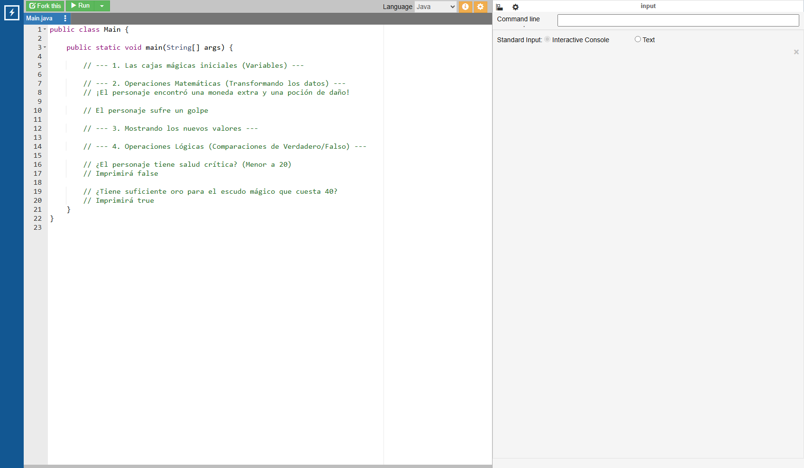
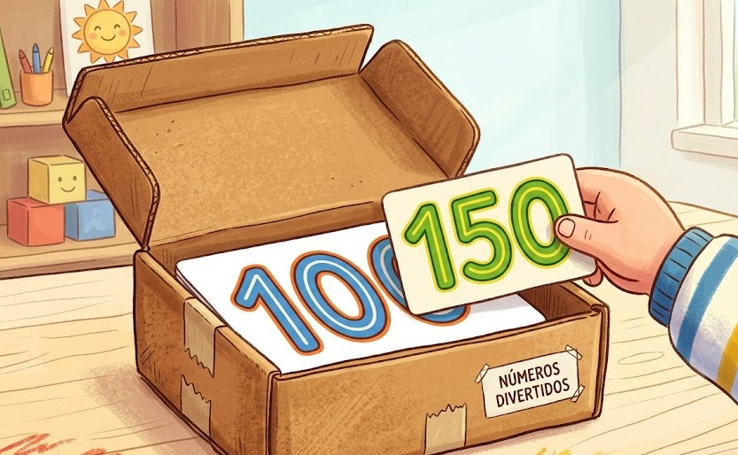
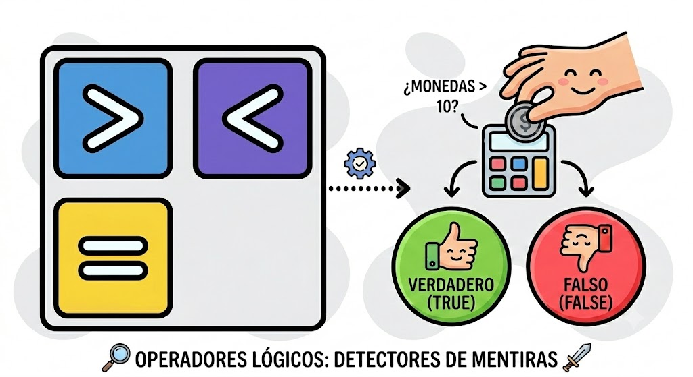

# Operaciones y Superpoderes

## Video de la Clase y Entorno de Práctica

*Enlace al video de YouTube:* [**https://youtu.be/bn6O6CUm-W8**](https://youtu.be/bn6O6CUm-W8)

Para esta clase continuaremos usando **OnlineGDB**, un entorno de programación en línea que funciona directamente desde el navegador. No necesitas instalar nada en tu computadora. Solo haz clic en el siguiente enlace y verás el código inicial de la clase ya listo para ejecutar: [**https://onlinegdb.com/E5iM0EisJ**](https://onlinegdb.com/E5iM0EisJ)

Una vez que abras el enlace, verás una interfaz dividida en dos paneles: a la izquierda está el editor de código donde escribiremos nuestras instrucciones, y a la derecha aparecerá la consola donde la computadora nos mostrará los resultados. Para ejecutar el programa, simplemente presiona el botón verde de "Run" en la parte superior.

{width=80%}

## Notas de la Clase
¡Hola, futuros creadores de software! En nuestra última aventura, aprendimos a guardar información en cajas mágicas llamadas variables. Pero, ¿qué pasa en un videojuego cuando tu personaje encuentra una poción de salud o recibe daño de un monstruo? El valor en esa caja tiene que cambiar. Hoy vamos a darle a nuestra aplicación el superpoder de las matemáticas y la inteligencia lógica.

{width=50%}

**Superpoderes Matemáticos:**
Java es como una calculadora gigante ultra rápida. Podemos usar las mismas operaciones que haces en la escuela: suma (`+`), resta (`-`), multiplicación (`*` que representamos con un asterisco) y división (`/` que es una barra inclinada). Si tu personaje tiene 100 puntos de vida y recibe una poción de 50 puntos, le decimos a la computadora: `vida = vida + 50`. ¡Así de sencillo! Java resolverá la matemática y guardará el nuevo resultado en la caja de inmediato.

**Inteligencia Lógica y el Detector de Mentiras:**
Además de las matemáticas, nuestra aplicación puede hacer preguntas. Por ejemplo, ¿tengo más de 10 monedas para comprar esa espada? Aquí usamos operaciones lógicas que actúan como pequeños detectores de mentiras. Comparamos valores usando el símbolo mayor que (`>`), menor que (`<`), o si dos cosas son exactamente iguales usando dos signos de igual (`==`). La computadora siempre responderá con un simple "Verdadero" (`true`) o "Falso" (`false`). A este tipo de respuestas precisas las llamamos "Booleanos".

{width=50%}

**Código en Acción: Combinando Poderes**
Miremos la pantalla. En nuestro entorno online, vamos a crear dos variables: `fuerza` y `magia`. Si queremos calcular el `poderTotal`, simplemente decimos:
```java
int poderTotal = fuerza + magia;
```
¡Nuestra aplicación hace el cálculo automáticamente! Luego, podemos imprimir una pregunta: "¿Es mi poder mayor a 100?". Escribimos:
```java
System.out.println(poderTotal > 100);
```
Si sumamos 60 de fuerza y 50 de magia, nos mostrará `true`.

## Actividad Práctica:

**El Reto de la Tienda de Hechizos:**
Tu héroe entró a una tienda para comprar suministros mágicos, ¡pero la computadora de la tienda falló! Usa la tuya para calcular cuánto oro le falta y ayudarle a completar su compra.

## Proyecto Integrador: El Registro de Estudiantes

En nuestro proyecto principal (el **Registro del Club Escolar**), a menudo necesitamos saber si los estudiantes son mayores de edad y calcular métricas básicas. Sigamos modificando la aplicación del club:

**Agrega al código de nuestro sistema de registro:**

```java
// Datos base
int añoActual = 2026;
int añoNacimiento = 2009;

// Operación: Cálculo automático de la edad del estudiante
int edadCalculada = añoActual - añoNacimiento;

// Operación Lógica: Determinar si el estudiante requiere permiso de los padres (menor de 18)
boolean requierePermiso = edadCalculada < 18;

// Mostrando los resultados
System.out.println("---- Análisis de Datos ----");
System.out.println("Edad calculada del estudiante: " + edadCalculada + " años.");
System.out.println("¿Requiere permiso de los padres para el club?: " + requierePermiso);
```

## Recursos Complementarios de la Clase

- **Código inicial de la lección:** [starter-files/lesson-03/Main.java](https://github.com/upc-pre-1asi0729-11848-arcadiadevs/java-fundamentals-course-arcadiadevs/blob/main/starter-files/lesson-03/Main.java)
- **Código elaborado en clase:** [completed-examples/lesson-03/Main.java](https://github.com/upc-pre-1asi0729-11848-arcadiadevs/java-fundamentals-course-arcadiadevs/blob/main/completed-examples/lesson-03/Main.java)

\newpage
