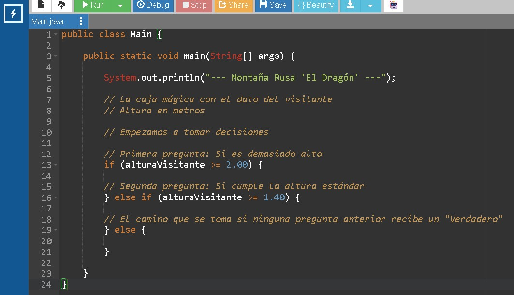
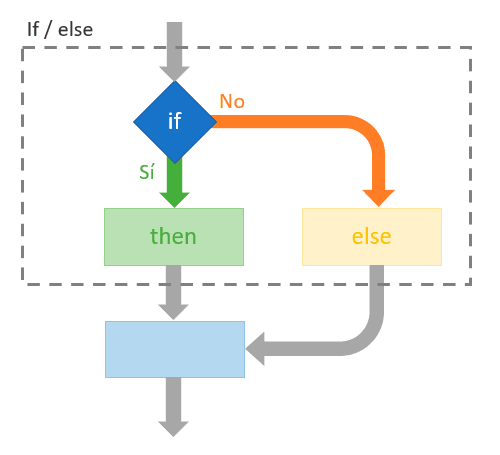

# Decisiones: ¿Qué camino tomar?

## Video de la Clase
*Enlace al video de YouTube:* [Añadir enlace aquí]

## Entorno de Práctica
Empieza a programar de inmediato (¡Sin instalar nada!):

- **[Abrir OnlineGDB - Código inicial precargado: https://onlinegdb.com/SGfcIy9Wp](https://onlinegdb.com/SGfcIy9Wp)**



## Notas de la Clase
¡Hola, creadores de tecnología! Hasta ahora, nuestra aplicación sabe recordar cosas e incluso hacer sumas o comparaciones. Pero hay algo que hacemos los humanos todos los días que hace que nuestras vidas sean interesantes: tomar decisiones. Piensa en tu mañana: si está lloviendo, llevas un paraguas; si hace sol, llevas gorra. Hoy, vamos a enseñarle a nuestra aplicación a pensar exactamente igual. ¡Vamos a darle la capacidad de elegir!


**La Analogía del Guardia de Seguridad (`if-else`):**
Imagina una montaña rusa increíble. En la entrada hay un guardia de seguridad con una regla de medir. La instrucción es clara: "Si mides más de 1.40 metros, puedes subir. Si no, debes buscar otra atracción". En Java, a esta instrucción la llamamos `if` (que en inglés significa "si" condicional) y `else` (que sería nuestro "si no"). Funciona como un camino en forma de "Y". La aplicación llega, se hace una pregunta (nuestro detector de mentiras Verdadero/Falso de la clase pasada) y toma un camino u otro. ¡Nunca los dos a la vez!



**Código en Acción: Programando al Guardia:**
Viajemos a nuestra plataforma online. Abriremos nuestras llaves mágicas que encierran las acciones de cada camino. Vamos a escribir:
```java
if (alturaUsuario > 1.40) { System.out.println("¡A divertirse!"); }
``` 
¡Así de rápido! Y si queremos dar una respuesta para el otro camino, añadimos: 
```java
else { System.out.println("Lo siento, vuelve el otro año."); }
```
Con esto, la computadora salta automáticamente a la respuesta correcta según la altura que guardemos en nuestra variable. 

**Múltiples Caminos (`else if`):**
¿Pero qué pasa si el usuario mide más de 2 metros y golpeará su cabeza con la montaña rusa de túneles? En ese caso, necesitamos un camino extra antes del "si no". Usamos `else if`, que nos permite hacer una segunda pregunta: "¿Mide más de 2 metros?". De esta manera podemos agregar tantas opciones como escenarios necesitemos controlar en un juego o sistema. La aplicación revisa la primera pregunta, luego la segunda y, como último recurso, cae en el `else`.

**Resumen y Desafío Práctico:**
Resumiendo: `if` pregunta "si ocurre algo", `else if` da una segunda oportunidad, y `else` es la ruta por defecto. El poder de las decisiones hace que tu programa sea inteligente. Tu misión de hoy será programar una zona VIP de un club secreto. ¡Manos a la obra, y nos vemos en la próxima lección!

## Actividad Práctica:

**El Reto de la Puerta Secreta:**
Eres el guardián digital del Club de Superhéroes y la contraseña ha cambiado.

1. Borra el código del guardia de la montaña rusa.
2. Crea una variable con la contraseña que te da el visitante: `String claveSecreta = "batman123";`
3. Usa un `if` para preguntar si `claveSecreta` equivale a la correcta (`"maravilla"`. *Nota final:* En textos `String`, Java no usa el símbolo `==`, sino un método llamado `.equals("maravilla")`). 
4. Tu reto: imprime `"¡Bienvenido a la cueva!"` si la acierta, o un `else` que imprima `"Intruso detectado"` si falla. ¡Prueba cambiando el contenido de la variable para confirmar ambos caminos!

*Tip:* Sería algo como: `if (claveSecreta.equals("maravilla")) { ... }`

## Proyecto Integrador: El Registro de Estudiantes

Continuemos trabajando en nuestra aplicación del **Registro del Club Escolar**. Ya calculábamos si un estudiante requería permiso pero solo imprimíamos `true` o `false`. Ahora haremos que el sistema hable en lenguaje humano tomando una decisión.

**Modifica y agrega este condicional a nuestro sistema de registro:**
```java
// Tomamos el booleano 'requierePermiso' (que vale true o false) 
// de la lección pasada (ej. porque el estudiante tiene 16 años y necesita permiso)

if (requierePermiso) {
    // Camino Verdadero
    System.out.println("ALERTA: Este estudiante es menor de edad.");
    System.out.println("-> Acción requerida: Imprimir e invalidar la hoja de permiso físico firmada por apoderado.");
} else {
    // Camino Falso
    System.out.println("Estudiante mayor de edad detectado.");
    System.out.println("-> Acción requerida: Firmar los términos y condiciones directamente.");
}
```

## Recursos Complementarios del Proyecto


- **Código inicial de la lección:** [starter-files/lesson-04/Main.java](../../starter-files/lesson-04/Main.java)
- **Código elaborado en clase:** [completed-examples/lesson-04/Main.java](../../completed-examples/lesson-04/Main.java)

\newpage