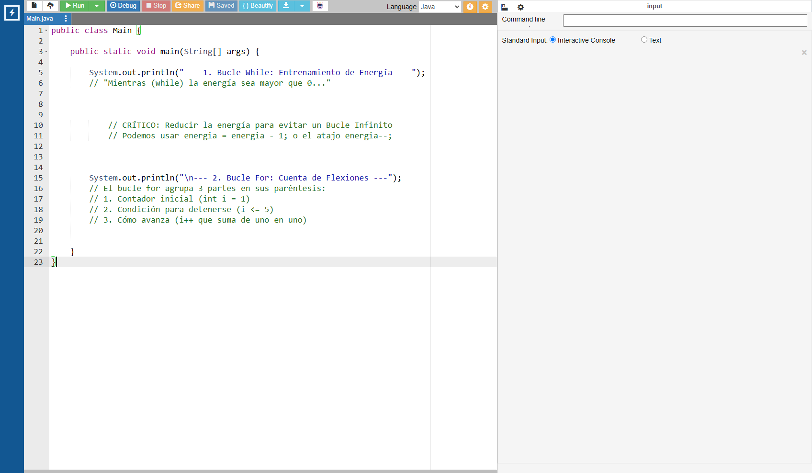

# El Bucle Infinito (y cómo evitarlo)

## Video de la Clase y Entorno de Práctica

*Enlace al video de YouTube:* [**https://youtu.be/oGUC9LY47PU**](https://youtu.be/oGUC9LY47PU)

Para esta clase continuaremos usando **OnlineGDB**, el entorno de desarrollo en línea que funciona directamente desde el navegador. No necesitas instalar nada en tu computadora. Haz clic en el siguiente enlace para abrir el código inicial de la clase ya precargado: [**https://onlinegdb.com/Jv99DRncv**](https://onlinegdb.com/Jv99DRncv) 

Al igual que en las clases anteriores, verás la interfaz con el editor de código a la izquierda y la consola a la derecha. Recuerda que para ejecutar el programa debes presionar el botón verde de "Run" en la parte superior de la pantalla.

{width=80%}

## Notas de la Clase

Hola de nuevo, creadores! Hoy aprenderemos a usar los "bucles", que son estructuras que le dicen a la computadora que repita algo por nosotros, a toda velocidad. Los bucles son una de las herramientas más poderosas de la programación porque nos permiten ejecutar tareas repetitivas sin tener que escribir el mismo código una y otra vez. Imagina si tuvieras que escribir `System.out.println()` 100 veces para imprimir los números del 1 al 100: con un bucle, lo logramos en apenas unas líneas.

**El Bucle "Mientras" (`while`) y el bucle "Para" (`for`)**

{width=80%}

Los bucles nos permiten repetir tareas automáticamente sin escribir el mismo código una y otra vez. En Java tenemos dos tipos principales de bucles:

- **Bucle `while`:** Funciona bajo una condición. Imagina que comes palomitas: "Mientras haya palomitas en el tazón, toma una y cómetela".
    \par
    {width=60%}
    \par
    La computadora repetirá el código mientras la condición sea Verdadera. Nota crítica: Si olvidas programar la instrucción que "vacía el tazón" (reducir la variable), el programa caerá en un bucle infinito y se congelará. Por eso es fundamental siempre tener una forma de que el bucle termine.

- **Bucle `for`:** Es perfecto cuando sabes el número exacto de repeticiones (como dar 3 vueltas a una pista de atletismo). En una sola línea, crea un contador automático, establece el límite de vueltas y aumenta el conteo en cada giro, haciéndolo mucho más seguro y ordenado.

## Actividad Práctica de la Clase: 

**El Reto del Lanzamiento Espacial:**

La agencia espacial te contrató para crear el contador regresivo automático del cohete Misión Java 1. Tu objetivo es usar un bucle `for` que comience en 10 y cuente hacia atrás hasta 1, imprimiendo "T menos [número]" en cada paso. Al final del bucle, imprime "¡Despegue!" para indicar que la cuenta ha terminado.

_Nota: Recuerda usar el operador `--` o la resta para decrementar el contador, y asegúrate de que la condición del bucle permita que se ejecute hasta llegar a 1._

## Proyecto Integrador: El Registro de Estudiantes

Hasta ahora hemos registrado de a uno, pero sabemos que en la escuela hay fila. Vamos a preparar a nuestro **Registro del Club Escolar** automatizando la impresión de tickets en blanco para los primeros miembros de la mañana.

En el mundo real, los sistemas de impresión de tickets son comunes en tiendas, hospitales y escuelas. Cuando llegas a una fila, tomas un número y la máquina imprime un ticket con tu información. Nosotros haremos algo similar: usaremos un bucle `for` para imprimir automáticamente varios tickets con los mismos campos, ahorrándole tiempo al usuario.

**Agrega al código de nuestro sistema de registro:**

```java
System.out.println("--- Preparando el sistema de registro ---");
System.out.println("Imprimiendo tickets de inscripción. Por favor espere...");

// Usaremos un bucle for para imprimir 3 tickets idénticos rápidamente
for (int numeroTicket = 1; numeroTicket <= 3; numeroTicket++) {
    
    System.out.println("\n[ TICKET DE EXCLUSIVIDAD #" + numeroTicket + " ]");
    System.out.println("Nombre Estudiante: _________________");
    System.out.println("Firma de Aprobación: _______________");
    
}

System.out.println("\n¡Tickets impresos exitosamente!");
```

Observa que el bucle `for` se encarga de repetir la impresión del ticket 3 veces automáticamente. En cada vuelta, la variable `numeroTicket` cambia de valor (1, 2, 3), lo que nos permite mostrar el número de ticket actual. Sin el bucle, tendríamos que escribir el mismo bloque de código tres veces de forma manual.

## Recursos Complementarios de la Clase

- **Código inicial de la lección:** [starter-files/lesson-05/Main.java](https://github.com/upc-pre-1asi0729-11848-arcadiadevs/java-fundamentals-course-arcadiadevs/blob/main/starter-files/lesson-05/Main.java)
- **Código elaborado en clase:** [completed-examples/lesson-05/Main.java](https://github.com/upc-pre-1asi0729-11848-arcadiadevs/java-fundamentals-course-arcadiadevs/blob/main/completed-examples/lesson-05/Main.java)

\newpage
