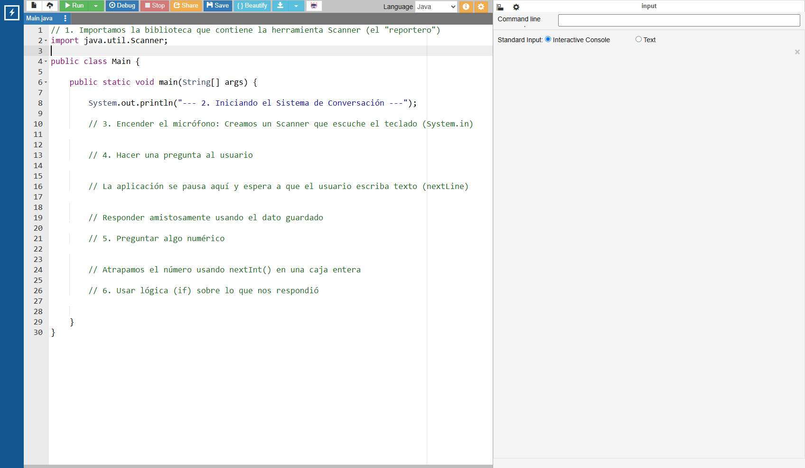

# Hablando con la Computadora

## Video de la Clase y Entorno de Práctica

*Enlace al video de YouTube:* [**https://youtu.be/mTaBdmJT4Gg**](https://youtu.be/mTaBdmJT4Gg)

Para esta clase continuaremos usando **OnlineGDB**, un entorno de programación en línea que funciona directamente desde el navegador. No necesitas instalar nada en tu computadora. Solo haz clic en el siguiente enlace y verás el código inicial de la clase ya listo para ejecutar: [**https://onlinegdb.com/f1SSDuoN7**](https://onlinegdb.com/f1SSDuoN7)

Una vez que abras el enlace, verás una interfaz dividida en dos paneles: a la izquierda está el editor de código donde escribiremos nuestras instrucciones, y a la derecha aparecerá la consola donde la computadora nos mostrará los resultados. Para ejecutar el programa, simplemente presiona el botón verde de "Run" en la parte superior.

{width=80%}

## Notas de la Clase

¡Hola, equipo creador! Hasta ahora, nuestra aplicación solo nos habla a nosotros. Escribe saludos, nos cuenta historias y nos da resultados matemáticos, pero es un monólogo. Para que un videojuego o programa sea realmente divertido, necesitamos que la computadora nos escuche. Hoy vamos a enseñarle a nuestra aplicación a prestar atención a nuestro teclado y responder en consecuencia.

{width=40%}

**El Micrófono de la Computadora (`Scanner`)**

Imagina a un reportero en la calle con un micrófono, esperando a que alguien hable. En Java, ese reportero tiene un nombre especial: se llama `Scanner`. Es una herramienta (o clase) que viene incluida en una caja de herramientas gigante que nos regala Java, llamada biblioteca estándar. Así que lo primero que debemos hacer es "pedir prestado" el micrófono usando la palabra mágica `import`. Luego, creamos nuestro propio reportero en nuestro código y le decimos que esté atento al teclado (`System.in`).

{width=50%}

**Guardando lo que Escuchamos**

Cuando el reportero escucha algo y tú presionas la tecla "Enter", no podemos simplemente dejar que esas palabras se las lleve el viento. Tenemos que guardarlas en las cajas mágicas (variables) que ya conocemos. Si el usuario escribe su nombre, lo atrapamos en una caja de tipo `String` usando una instrucción llamada `nextLine()`. Si escribe su edad, la atrapamos en un `int` usando `nextInt()`.
¡Así nuestra aplicación aprenderá y recordará quiénes somos!

## Actividad Práctica de la Clase:

**El Reto del Asistente Personal:**

Tu asistente debe preparar tu desayuno, pero primero necesita conocer tus preferencias. Tu objetivo es que te pregunte por dos opciones de desayuno, que almacene tu respuesta en una variable de tipo `String` y que, al final, te escriba: "¡Marchando una orden de [desayuno] para ti!".
## Proyecto Integrador: El Registro de Estudiantes

¡Al fin nuestro **Registro del Club Escolar** será interactivo! Las variables ya no las escribiremos nosotros en el código con valores fijos; ahora la secretaria del club las tecleará cuando un estudiante se acerque a inscribirse.

**Agrega al código de nuestro sistema de registro:**

```java
// Arriba del todo "import java.util.Scanner;"

Scanner teclado = new Scanner(System.in);

System.out.println("--- Sistema de Registro del Club Escolar ---");
System.out.println("Secretaría: Ingrese el nombre del nuevo miembro: ");
String nuevoNombre = teclado.nextLine();

System.out.println("Secretaría: Ingrese la edad del miembro: ");
int nuevaEdad = teclado.nextInt();

// Evaluamos si el estudiante necesita permiso (como en la lección 3 y 4)
boolean permisoPadres = nuevaEdad < 18;

// Imprimimos el resumen de la inscripción
System.out.println("\n--- TICKET DE REGISTRO COMPLETADO ---");
System.out.println("Estudiante: " + nuevoNombre);

if (permisoPadres) {
    System.out.println("ESTADO: Pendiente de firma de apoderado (Menor de edad).");
} else {
    System.out.println("ESTADO: Membresía 100% activa.");
}
```

## Recursos Complementarios de la Clase

- **Código inicial de la lección:** [starter-files/lesson-06/Main.java](https://github.com/upc-pre-1asi0729-11848-arcadiadevs/java-fundamentals-course-arcadiadevs/blob/main/starter-files/lesson-06/Main.java)
- **Código elaborado en clase:** [completed-examples/lesson-06/Main.java](https://github.com/upc-pre-1asi0729-11848-arcadiadevs/java-fundamentals-course-arcadiadevs/blob/main/completed-examples/lesson-06/Main.java)

\newpage
