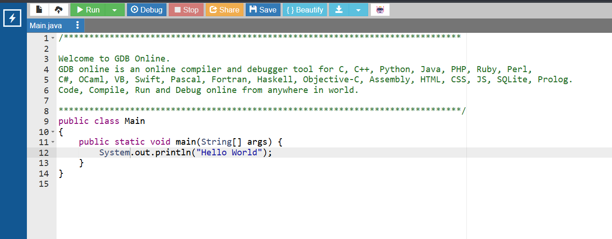

# Lección 6: Hablando con la Computadora

## Video de la Clase

*Enlace al video de YouTube:* [Añadir enlace aquí]

## Entorno de Práctica

Empieza a programar de inmediato (¡Sin instalar nada!):

- **[Abrir OnlineGDB - Código inicial precargado: https://onlinegdb.com](https://onlinegdb.com)**



## Transcripción / Notas de la Clase

¡Hola, equipo creador! Hasta ahora, nuestra aplicación solo nos habla a nosotros. Escribe saludos, nos cuenta historias y nos da resultados matemáticos, pero es un monólogo. Para que un videojuego o programa sea realmente divertido, necesitamos que la computadora nos escuche. Hoy vamos a enseñarle a nuestra aplicación a prestar atención a nuestro teclado y responder en consecuencia.


**El Micrófono de la Computadora (`Scanner`):**
Imagina a un reportero en la calle con un micrófono, esperando a que alguien hable. En Java, ese reportero tiene un nombre especial: se llama `Scanner`. Es una herramienta (o clase) que viene incluida en una caja de herramientas gigante que nos regala Java, llamada biblioteca estándar. Así que lo primero que debemos hacer es "pedir prestado" el micrófono usando la palabra mágica `import`. Luego, creamos nuestro propio reportero en nuestro código y le decimos que esté atento al teclado (`System.in`).


**Guardando lo que Escuchamos:**
Cuando el reportero escucha algo y tú presionas la tecla "Enter", no podemos simplemente dejar que esas palabras se las lleve el viento. Tenemos que guardarlas en las cajas mágicas (variables) que ya conocemos. Si el usuario escribe su nombre, lo atrapamos en una caja de tipo `String` usando una instrucción llamada `nextLine()`. Si escribe su edad, la atrapamos en un `int` usando `nextInt()`. ¡Así nuestra aplicación aprenderá y recordará quiénes somos!

**Código en Acción: La Entrevista**
Primero escribimos arriba, afuera de todo: `import java.util.Scanner;`. Luego, encendemos el micrófono. Miren cómo la consola se queda parpadeando, esperando. ¡Está esperando que yo escriba! Le digo a mi computadora que mi color favorito es el azul. Presiono Enter. ¡Guau! La aplicación acaba de responder "El azul es un color genial". ¡Ya estamos conversando!

```java
// 1. Importamos la biblioteca que contiene la herramienta Scanner (el "reportero")
import java.util.Scanner;

public class Main {
    
    public static void main(String[] args) {
        
        System.out.println("--- 2. Iniciando el Sistema de Conversación ---");
        
        // 3. Encender el micrófono: Creamos un Scanner que escuche el teclado (System.in)
        Scanner reportero = new Scanner(System.in);
        
        // 4. Hacer una pregunta al usuario
        System.out.println("¡Hola! Soy tu asistente virtual. ¿Cómo te llamas?");
        
        // La aplicación se pausa aquí y espera a que el usuario escriba texto (nextLine)
        String nombreUsuario = reportero.nextLine();
        
        // Responder amistosamente usando el dato guardado
        System.out.println("¡Es un gusto conocerte, " + nombreUsuario + "!");
        
        // 5. Preguntar algo numérico
        System.out.println("¿Cuántos años tienes?");
        
        // Atrapamos el número usando nextInt() en una caja entera
        int edad = reportero.nextInt();
        
        System.out.println("Increíble. Yo tengo apenas 5 milisegundos de haber sido creado.");
        
        // 6. Usar lógica (if) sobre lo que nos respondió
        if (edad >= 18) {
            System.out.println("¡Ya eres mayor de edad! Puedes ver las funciones completas.");
        } else {
            System.out.println("Disfruta tu juventud. Te mostraré los juegos más divertidos.");
        }
        
    }
}

```

**Resumen y Desafío:**
Resumiendo: Para hablar con la computadora, importamos el `Scanner`, lo encendimos y guardamos lo que escribe el usuario usando `nextLine()` o `nextInt()`. ¡Ahora es tu turno! Transforma tu aplicación en un adivino interactivo. Te espero en la próxima lección donde empezaremos a construir nuestros propios planos y objetos del mundo real.

## Actividad Práctica:

**El Reto del Asistente Personal:**
Tu asistente debe preparar tu desayuno, pero necesita saber tus preferencias primero.

1. Importa y crea el `Scanner`.


2. Pregunta usando un `System.out.println` qué tipo de desayuno prefiere el usuario (ej. "¿Huevos o Cereal?").


3. Crea un `String desayuno = ...` y usa tu escáner con `nextLine()` para guardar su respuesta.


4. Imprime finalmente `"¡Marchando una orden de " + desayuno + " para ti!"`.


5. (Opcional): Agrégale una pregunta más sobre a qué hora (`int`) le gustaría desayunar y captúrala con `nextInt()`.


## Proyecto Integrador: El Registro de Estudiantes

¡Al fin nuestro **Registro del Club Escolar** será interactivo! Las variables ya no las escribiremos nosotros en el código con valores fijos; ahora la secretaria del club las tecleará cuando un estudiante se acerque a inscribirse.

**Modifica la versión anterior de nuestro sistema por esta interactiva:**

```java
// Arriba del todo "import java.util.Scanner;"

Scanner teclado = new Scanner(System.in);

System.out.println("--- Sistema de Registro del Club Escolar ---");
System.out.println("Secretaría: Ingrese el nombre del nuevo miembro: ");
String nuevoNombre = teclado.nextLine();

System.out.println("Secretaría: Ingrese la edad del miembro: ");
int nuevaEdad = teclado.nextInt();

// Evaluamos si el estudiante necesita permiso (como en la lección 3 y 4)
boolean permisoPadres = nuevaEdad < 18;

// Imprimimos el resumen de la inscripción
System.out.println("\n--- TICKET DE REGISTRO COMPLETADO ---");
System.out.println("Estudiante: " + nuevoNombre);

if (permisoPadres) {
    System.out.println("ESTADO: Pendiente de firma de apoderado (Menor de edad).");
} else {
    System.out.println("ESTADO: Membresía 100% activa.");
}

```

## Recursos Complementarios del Proyecto


- **Código inicial de la lección:** [starter-files/lesson-03/Main.java](../../starter-files/lesson-03/Main.java)
