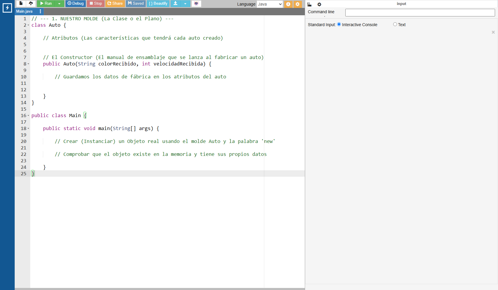

# Planos y Objetos (Intro a POO)

## Video de la Clase y Entorno de Práctica

*Enlace al video de YouTube:* [**https://youtu.be/BC05SINWsPw**](https://youtu.be/BC05SINWsPw)

Para esta clase continuaremos usando **OnlineGDB**, el entorno de desarrollo en línea que funciona directamente desde el navegador. No necesitas instalar nada en tu computadora. Haz clic en el siguiente enlace para abrir el código inicial de la clase ya precargado: [**https://onlinegdb.com/q-w8GXz3T**](https://onlinegdb.com/q-w8GXz3T)

Al igual que en las clases anteriores, verás la interfaz con el editor de código a la izquierda y la consola a la derecha. Recuerda que para ejecutar el programa debes presionar el botón verde de "Run" en la parte superior de la pantalla.

{width=80%}

## Notas de la Clase

¡Hola, creadores de verdad! Hasta ahora hemos creado juegos y sistemas usando variables sueltas: una caja para la edad, otra para el nombre. Pero el mundo real no funciona así. Un perro no es solo un nombre flotando; es un ser que tiene raza, edad, color y además puede ladrar o correr. Hoy daremos el gran salto a la "Programación Orientada a Objetos" o POO. Le enseñaremos a nuestra computadora a pensar en elementos complejos del mundo real.

**La Analogía del Molde de Galletas (`Clase` y `Objeto`)**

Piensa en cuando horneas galletas. Usas un molde de metal con forma de estrella. El molde en sí no se puede comer, ¿verdad? Solo sirve para darle forma a la masa. En Java, a ese molde le llamamos `Clase`. Es el plano o diseño.

Cuando usamos ese molde en la masa y la horneamos, obtenemos una galleta real que sí podemos comer y decorar. A esa galleta terminada le llamamos `Objeto`. A partir de un solo molde o Clase, ¡podemos crear cien galletas u Objetos diferentes!

{width=60%}


**Partes del Molde: Atributos y Constructores**

Para construir nuestro propio molde en Java, por ejemplo el plano de un `Auto`, necesitamos decirle dos cosas. Primero, ¿qué características tendrá todo auto que salga de aquí? A esto le llamamos "Atributos": como el `color` o la `velocidad`. Segundo: necesitamos un manual de ensamblaje. En Java, este manual recibe el nombre exacto de la clase y se llama "Constructor". Es el bloque de código que se ejecuta en el instante exacto en que nace nuestro objeto, para pintarlo del color que queramos antes de que salga de la fábrica.

**Código en Acción**

Fuera de nuestra puerta principal (`main`), vamos a crear un nuevo recetario llamado `class Auto`. Le pondremos dos cajas mágicas vacías: un `String color` y un `int velocidad`. Luego, creamos el constructor `public Auto(...)` donde recibiremos los datos de fábrica.

Ahora lo más emocionante: volvamos a nuestro bloque `main`. Para crear el objeto real usaremos la palabra mágica `new` (que significa "nuevo" y manda a fabricar el objeto). Escribiremos: `Auto miCoche = new Auto("Rojo", 150);`. ¡Acabamos de materializar un auto dentro de la memoria de la computadora!

{width=60%}

## Actividad Práctica de la Clase:

**El Reto de la Panadería:**

La panadería del abuelo se está modernizando y necesita un molde digital para sus galletas. Tu objetivo es que el programa te permita registrar dos tipos de galletas diferentes con sus características de sabor y chispas y que, al final, te muestre un mensaje confirmando las galletas que se han horneado con éxito.

## Proyecto Integrador: El Registro de Estudiantes

Transformemos el Club Escolar para que deje de usar variables sueltas y comience a pensar en términos de POO. Crearemos el plano maestro para cualquier `Estudiante` nuevo.

**Modifica la estructura de nuestro registro:**

```java
// Nuestro Molde de Estudiante
class Estudiante {
    String nombre;
    int edad;
    boolean tienePermiso;

    // Nuestro ensamblador (Constructor)
    public Estudiante(String n, int e) {
        nombre = n;
        edad = e;
        tienePermiso = e >= 18; // Calculamos automáticamente su permiso al registrarse
    }
}

public class Main {

    public static void main(String[] args) {

        System.out.println("--- Sistema POO del Club Escolar ---");
        System.out.println("Registrando nuevos ingresos...\n");

        // Registramos objetos en lugar de llenar docenas de variables
        Estudiante alumno1 = new Estudiante("Carlos", 16);
        Estudiante alumno2 = new Estudiante("Laura", 19);

        System.out.println("Socia 2: " + alumno2.nombre);
        System.out.println("¿Laura tiene permiso validado?: " + alumno2.tienePermiso);

        System.out.println("\nSocio 1: " + alumno1.nombre);
        System.out.println("¿Carlos tiene permiso validado?: " + alumno1.tienePermiso);
    }
}
```

## Recursos Complementarios de la Clase

- **Código inicial de la lección:** [starter-files/lesson-07/Main.java](https://github.com/upc-pre-1asi0729-11848-arcadiadevs/java-fundamentals-course-arcadiadevs/blob/main/starter-files/lesson-07/Main.java)
- **Código elaborado en clase:** [completed-examples/lesson-07/Main.java](https://github.com/upc-pre-1asi0729-11848-arcadiadevs/java-fundamentals-course-arcadiadevs/blob/main/completed-examples/lesson-07/Main.java)

\newpage
