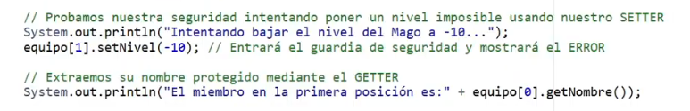

# Seguridad y Proyecto Final

## Video de la Clase
*Enlace al video de YouTube:* [https://youtu.be/ZBgI_4ZwoPA](https://youtu.be/ZBgI_4ZwoPA)

## Entorno de Práctica
Empieza a programar de inmediato (¡Sin instalar nada!):

- **[Abrir OnlineGDB - Código inicial precargado: https://onlinegdb.com](https://onlinegdb.com)**


## Notas de la Clase
¡Hola, grandes creadores! Llegamos a nuestra última aventura. En la lección anterior aprendimos a construir objetos a partir de planos (clases). Nuestro sistema funciona, pero tiene un problema grave de seguridad: cualquiera puede modificar los datos de un objeto desde afuera y ponerle valores imposibles como "-10" o "1000", ¡rompiendo toda nuestra aplicación! Hoy aprenderemos a poner candados a nuestros datos para que nadie haga trampa, y construiremos la versión definitiva de nuestro proyecto.


**El Diario Íntimo: `private`, Getters y Setters:**
Imagina que tienes un diario con todos tus secretos. No lo dejas abierto en la mesa de la sala para que cualquiera lo borre o escriba encima: le pones un candado y tú eres el único que decides quién lo lee y qué se escribe. En Java logramos esto poniendo la palabra `private` antes de cada atributo de nuestra clase. Al hacerlo invisible desde afuera, creamos dos puertas de control: los **Getters** (para leer) y los **Setters** (para modificar). El Setter actúa como un guardia de seguridad: podemos programarlo para que, si alguien intenta poner un valor inválido, el guardia diga "¡Acceso denegado!" y simplemente no lo guarde.


**Código en Acción: Encapsulando nuestra clase `Héroe`:**
Vamos a agregar `private` a nuestra clase y crear sus puertas de acceso. Primero, blindamos los atributos:
```java
class Héroe {
    private String nombre; // 'private' prohíbe el acceso directo desde afuera
    private int nivel;

    public Héroe(String n, int initNivel) {
        nombre = n;
        nivel = initNivel;
    }

    // GETTER: el método seguro que solo permite 'Leer' el nombre
    public String getNombre() {
        return nombre;
    }

    // SETTER: el método seguro que permite 'Modificar' el nivel, pero con reglas
    public void setNivel(int nuevoNivel) {
        if (nuevoNivel > 0) {
            nivel = nuevoNivel;
        } else {
            System.out.println("ERROR: Un héroe no puede tener nivel negativo o cero.");
        }
    }
}
```
Con ese `if` dentro del Setter, la clase se protege sola. Si alguien llama a `setNivel(-10)`, el guardia intercepta el valor y la aplicación nunca llega a corromperse.

**Manejando Multitudes: Los `Arrays`:**
Nuestro equipo de héroes está creciendo y ya no podemos tener una variable suelta para cada uno: ¡sería un caos! Necesitamos construir un edificio. En programación a esto le llamamos "Arreglos" o `Arrays`. Son como un hotel donde reservamos un número exacto de habitaciones seguidas. La única regla curiosa es que las habitaciones no empiezan a contar desde el 1, ¡sino desde el 0! Un hotel de 5 habitaciones va de la habitación 0 a la habitación 4.


**Código en Acción: Construyendo nuestro equipo con Arrays:**
Declaramos el arreglo indicando el tipo de objeto que guardará y cuántas habitaciones reservar:
```java
public class Main {
    public static void main(String[] args) {

        System.out.println("--- CREANDO UN EQUIPO CON ARRAYS ---");

        // Creamos un "Hotel de Héroes" con 3 habitaciones disponibles
        Héroe[] equipo = new Héroe[3];

        // Asignamos héroes a las habitaciones (¡la primera es la número 0!)
        equipo[0] = new Héroe("Arquera", 5);
        equipo[1] = new Héroe("Mago", 8);

        // Probamos nuestra seguridad intentando poner un nivel imposible
        System.out.println("Intentando bajar el nivel del Mago a -10...");
        equipo[1].setNivel(-10); // El guardia intercepta el valor y muestra el ERROR

        // Leemos el nombre protegido de forma segura mediante el Getter
        System.out.println("El miembro en la primera posición es: " + equipo[0].getNombre());
    }
}
```

**Resumen y Cierre:**
Combinando `private` con Getters, Setters y Arrays, nuestro sistema ahora está blindado y puede manejar a muchos usuarios al mismo tiempo. Has aprendido qué es el código, a tomar decisiones lógicas, a conversar con tu aplicación e incluso a orientarla a la vida real con objetos seguros. ¡Eres oficialmente un creador de tecnología. Felicitaciones por terminar este curso y sigue programando lo imposible!

## Actividad Práctica:

**El Reto de la Caja Fuerte:**
El banco confió en tu aplicación para proteger las cuentas de la ciudad.

1. Crea una clase `CuentaBancaria` con un atributo protegido: `private double saldo;`.
2. Crea su constructor para darle un saldo inicial.
3. Escribe un método Setter llamado `public void depositar(double dineroNuevo)`.
4. **El truco:** dentro de ese método, usa un `if`. Si `dineroNuevo` es mayor a 0, súmalo al saldo. Si no, imprime un mensaje de `"Operación Inválida"`. ¡No queremos que nadie deposite dinero fantasma negativo!

*Tip:* La suma al saldo dentro del `if` sería algo como: `saldo = saldo + dineroNuevo;`

## Proyecto Integrador: El Registro de Estudiantes (Final)

¡Es el gran momento de coronar tu aplicación! Consolidemos todo lo aprendido en el curso: objetos, seguridad y arreglos. Nuestro código ahora maneja una lista real de los estudiantes que ingresan a nuestro Club.

**Agrega la clase `Estudiante` protegida y reemplaza el `main` con este código final:**
```java
import java.util.Scanner;

class Estudiante {
    private String nombre;
    private int edad;

    public Estudiante(String nombreInicial, int edadInicial) {
        this.nombre = nombreInicial;
        this.edad = edadInicial;
    }

    // Getter que expone solo un resumen, nunca los atributos directamente
    public String getResumen() {
        return "Miembro: " + nombre + " | Edad: " + edad + " años.";
    }
}

public class Main {
    public static void main(String[] args) {
        Scanner teclado = new Scanner(System.in);

        // Nuestro Array: capaz de alojar hasta 5 estudiantes en la memoria
        Estudiante[] clubEscolar = new Estudiante[5];

        System.out.println("--- Sistema Final de Registro del Club Escolar ---");

        // Bucle For para registrar automáticamente los 2 primeros estudiantes
        for (int i = 0; i < 2; i++) {
            System.out.println("\nIngresando registro #" + (i + 1));

            System.out.println("Digite nombre:");
            String nom = teclado.nextLine();

            System.out.println("Digite edad:");
            int ed = teclado.nextInt();
            teclado.nextLine(); // Limpiar el "Enter" flotante del escáner

            // Creamos el objeto y lo guardamos directamente en la habitación 'i' del arreglo
            clubEscolar[i] = new Estudiante(nom, ed);
        }

        System.out.println("\n--- REPORTE FINAL DE MIEMBROS ---");
        // Usamos getResumen() para leer la info de forma segura, nunca directamente
        System.out.println(clubEscolar[0].getResumen());
        System.out.println(clubEscolar[1].getResumen());

        System.out.println("\n¡Felicidades! Sistema implementado exitosamente.");
    }
}
```

## Recursos Complementarios del Proyecto



- **Código inicial de la lección:** [lesson-8/starter/Main.java](../../lesson-8/starter/Main.java)
- **Código elaborado en clase:** [lesson-8/completed/Estudiante.java](../../lesson-8/completed/Estudiante.java)
- **Oracle Java Tutorial:** [Controlling Access to Members of a Class](https://docs.oracle.com/javase/tutorial/java/javaOO/accesscontrol.html)
- **Oracle Java Tutorial:** [Arrays](https://docs.oracle.com/javase/tutorial/java/nutsandbolts/arrays.html)

\newpage