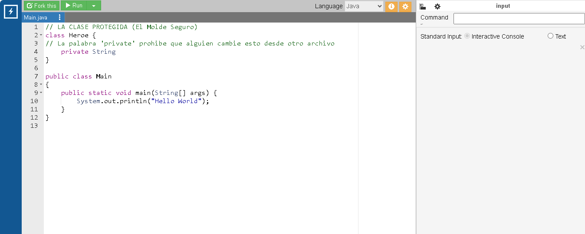
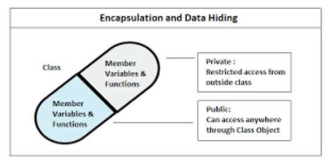

# Seguridad y Proyecto Final

## Video de la Clase y Entorno de Práctica

*Enlace al video de YouTube:* [**https://youtu.be/ZBgI_4ZwoPA**](https://youtu.be/ZBgI_4ZwoPA)

Para esta clase continuaremos usando **OnlineGDB**, el mismo entorno en línea que usamos en las clases anteriores. No necesitas instalar nada en tu computadora. Haz clic en el siguiente enlace para abrir el código inicial de la clase ya precargado: [**https://onlinegdb.com/bKfRzLfjx**](https://onlinegdb.com/bKfRzLfjx)

Una vez que abras el enlace, verás la interfaz con el editor de código a la izquierda y la consola a la derecha. Recuerda que para ejecutar el programa debes presionar el botón verde de "Run" en la parte superior de la pantalla.



## Notas de la Clase

¡Hola, grandes creadores! Llegamos a nuestra última aventura. En la lección anterior aprendimos a construir objetos a partir de planos (clases). Nuestro sistema funciona, pero tiene un problema grave de seguridad: cualquiera puede modificar los datos de un objeto desde afuera y ponerle valores imposibles como "-10" o "1000", ¡rompiendo toda nuestra aplicación! Hoy aprenderemos a poner candados a nuestros datos para que nadie haga trampa, y construiremos la versión definitiva de nuestro proyecto.

{width=60%}

**El Diario Íntimo: `private`, Getters y Setters**

Imagina que tienes un diario con todos tus secretos. No lo dejas abierto en la mesa de la sala para que cualquiera lo borre o escriba encima: le pones un candado y tú eres el único que decides quién lo lee y qué se escribe. En Java logramos esto poniendo la palabra `private` antes de cada atributo de nuestra clase. Al hacerlo invisible desde afuera, creamos dos puertas de control: los **Getters** (para leer) y los **Setters** (para modificar). El Setter actúa como un guardia de seguridad: podemos programarlo para que, si alguien intenta poner un valor inválido, el guardia diga "¡Acceso denegado!" y simplemente no lo guarde.

{width=50%}

**Código en Acción: Encapsulando nuestra clase `Héroe`**

Vamos a agregar `private` a nuestra clase y crear sus puertas de acceso. Primero, blindamos los atributos:

```java
class Héroe {
    private String nombre; // 'private' prohíbe el acceso directo desde afuera
    private int nivel;

    public Héroe(String n, int initNivel) {
        nombre = n;
        nivel = initNivel;
    }

    // GETTER: el método seguro que solo permite 'Leer' el nombre
    public String getNombre() {
        return nombre;
    }

    // SETTER: el método seguro que permite 'Modificar' el nivel, pero con reglas
    public void setNivel(int nuevoNivel) {
        if (nuevoNivel > 0) {
            nivel = nuevoNivel;
        } else {
            System.out.println("ERROR: Un héroe no puede tener nivel negativo o cero.");
        }
    }
}
```

Con ese `if` dentro del Setter, la clase se protege sola. Si alguien llama a `setNivel(-10)`, el guardia intercepta el valor y la aplicación nunca llega a corromperse. Observa que los atributos `nombre` y `nivel` están marcados como `private`, lo que significa que ningún código externo puede acceder directamente a ellos. Solo podemos leerlos a través del método `getNombre()` y modificarlos a través de `setNivel()`, que incluye validaciones de seguridad.

**Manejando Multitudes: Los `Arrays`**

Nuestro equipo de héroes está creciendo y ya no podemos tener una variable suelta para cada uno: ¡sería un caos! Necesitamos construir un edificio. En programación a esto le llamamos "Arreglos" o `Arrays`. Son como un hotel donde reservamos un número exacto de habitaciones seguidas. La única regla curiosa es que las habitaciones no empiezan a contar desde el 1, ¡sino desde el 0! Un hotel de 5 habitaciones va de la habitación 0 a la habitación 4.

{width=50%}

**Código en Acción: Construyendo nuestro equipo con Arrays**

Declaramos el arreglo indicando el tipo de objeto que guardará y cuántas habitaciones reservar:

```java
public class Main {
    public static void main(String[] args) {

        System.out.println("--- CREANDO UN EQUIPO CON ARRAYS ---");

        // Creamos un "Hotel de Héroes" con 3 habitaciones disponibles
        Héroe[] equipo = new Héroe[3];

        // Asignamos héroes a las habitaciones (¡la primera es la número 0!)
        equipo[0] = new Héroe("Arquera", 5);
        equipo[1] = new Héroe("Mago", 8);

        // Probamos nuestra seguridad intentando poner un nivel imposible
        System.out.println("Intentando bajar el nivel del Mago a -10...");
        equipo[1].setNivel(-10); // El guardia intercepta el valor y muestra el ERROR

        // Leemos el nombre protegido de forma segura mediante el Getter
        System.out.println("El miembro en la primera posición es: " + equipo[0].getNombre());
    }
}
```

En este código combinamos todo lo que hemos aprendido: la clase `Héroe` con atributos `private`, los métodos Getter y Setter para acceso controlado, y un `Array` para almacenar múltiples objetos. Cuando intentamos poner el nivel del Mago a -10, el Setter intercepta el valor inválido y muestra un error, demostrando que nuestra protección funciona correctamente.

## Actividad Práctica de la Clase: 

**El Reto de la Caja Fuerte:**

El banco confió en tu aplicación para proteger las cuentas de la ciudad. Tu objetivo es crear una clase `CuentaBancaria` con un atributo `private` para el saldo y un método Setter que valide que las transacciones sean positivas. Si alguien intenta depositar un monto negativo o cero, la aplicación debe rechazar la operación con un mensaje de error.

_Nota: Recuerda que el atributo saldo debe ser `private` para que no se pueda modificar directamente desde afuera. Solo el método Setter debe controlar los cambios._

## Proyecto Integrador: El Registro de Estudiantes (Final)

¡Es el gran momento de coronar tu aplicación! Consolidemos todo lo aprendido en el curso: objetos, seguridad y arreglos. Nuestro código ahora maneja una lista real de los estudiantes que ingresan a nuestro Club.

En las clases anteriores fuimos construyendo paso a paso nuestro sistema de registro. Comenzamos con simples mensajes de bienvenida, luego aprendimos a guardar datos en variables, a hacer operaciones matemáticas, a tomar decisiones con `if-else`, a repetir tareas con bucles, y finalmente a crear objetos con clases. Ahora, en esta última clase, unimos todos esos conocimientos en un proyecto completo que utiliza encapsulamiento (`private` con Getters y Setters), arreglos (`Arrays`) para manejar múltiples estudiantes, y bucles para automatizar el registro.

**Agrega la clase `Estudiante` protegida y reemplaza el `main` con este código final:**

```java
import java.util.Scanner;

class Estudiante {
    private String nombre;
    private int edad;

    public Estudiante(String nombreInicial, int edadInicial) {
        this.nombre = nombreInicial;
        this.edad = edadInicial;
    }

    // Getter que expone solo un resumen, nunca los atributos directamente
    public String getResumen() {
        return "Miembro: " + nombre + " | Edad: " + edad + " años.";
    }
}

public class Main {
    public static void main(String[] args) {
        Scanner teclado = new Scanner(System.in);

        // Nuestro Array: capaz de alojar hasta 5 estudiantes en la memoria
        Estudiante[] clubEscolar = new Estudiante[5];

        System.out.println("--- Sistema Final de Registro del Club Escolar ---");

        // Bucle For para registrar automáticamente los 2 primeros estudiantes
        for (int i = 0; i < 2; i++) {
            System.out.println("\nIngresando registro #" + (i + 1));

            System.out.println("Digite nombre:");
            String nom = teclado.nextLine();

            System.out.println("Digite edad:");
            int ed = teclado.nextInt();
            teclado.nextLine(); // Limpiar el "Enter" flotante del escáner

            // Creamos el objeto y lo guardamos directamente en la habitación 'i' del arreglo
            clubEscolar[i] = new Estudiante(nom, ed);
        }

        System.out.println("\n--- REPORTE FINAL DE MIEMBROS ---");
        // Usamos getResumen() para leer la info de forma segura, nunca directamente
        System.out.println(clubEscolar[0].getResumen());
        System.out.println(clubEscolar[1].getResumen());

        System.out.println("\n¡Felicidades! Sistema implementado exitosamente.");
    }
}
```

Este código representa la culminación de todo el curso. La clase `Estudiante` tiene atributos `private` que protegen los datos, un constructor que inicializa los valores de forma segura, y un método `getResumen()` que expone la información sin revelar los atributos directamente. El arreglo `clubEscolar` almacena hasta 5 estudiantes, y el bucle `for` automatiza el registro de los dos primeros. ¡Has construido un sistema de registro completo y seguro!

## Recursos Complementarios de la Clase

- **Código inicial de la lección:** [starter-files/lesson-08/Main.java](https://github.com/upc-pre-1asi0729-11848-arcadiadevs/java-fundamentals-course-arcadiadevs/blob/main/starter-files/lesson-08/Main.java)
- **Código elaborado en clase:** [completed-examples/lesson-08/Main.java](https://github.com/upc-pre-1asi0729-11848-arcadiadevs/java-fundamentals-course-arcadiadevs/blob/main/completed-examples/lesson-08/Main.java)

\newpage
